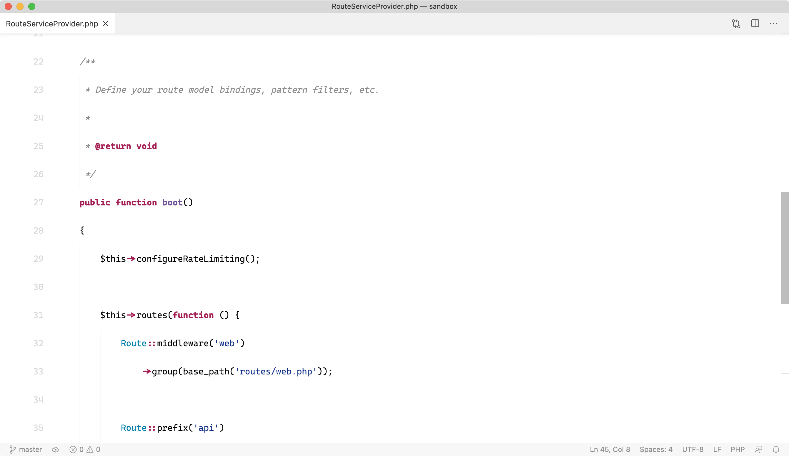

# Taylor Otwell inspired VSCode theme

This theme is based on the [Laravel Github - Classic theme](https://github.com/victorze/vscode-theme-laravel/blob/master/themes/github_clasic.json). A couple of edits are made to try and get as close as possible to Laravel creator Taylor Otwell's Inspired Github theme which he uses in SublimeText.



## Installation

Code copy the folder into the `<user home>/.vscode/extensions` folder and restart Code.

## Additional suggestions

Make sure to set up a pretty large line height and font size. As font, I believe Taylor uses Operator Mono but recently I have seen another font being used. I personally like Cascadia Code a lot.

You could add this to your VSCode settings file:

```json
{
    "editor.fontFamily": "Cascadia Code, Operator Mono, consolas",
    "editor.fontWeight": "300",
    "editor.fontSize": 15,
    "editor.lineHeight": 48,
    "editor.cursorStyle": "underline",
    "editor.fontLigatures": true,
    "workbench.iconTheme": null
}
```

**Enjoy!**
